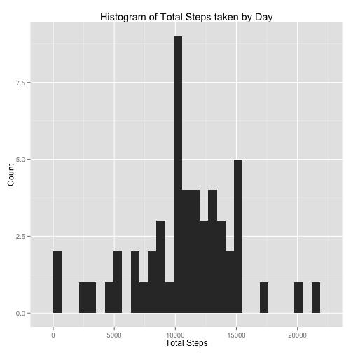
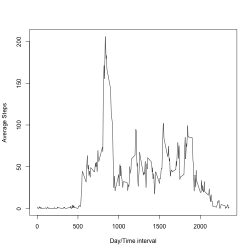
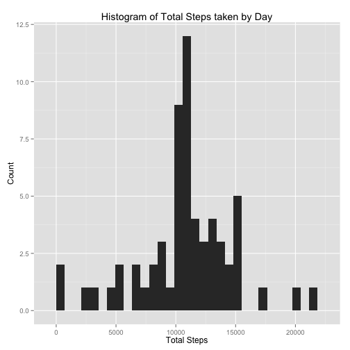
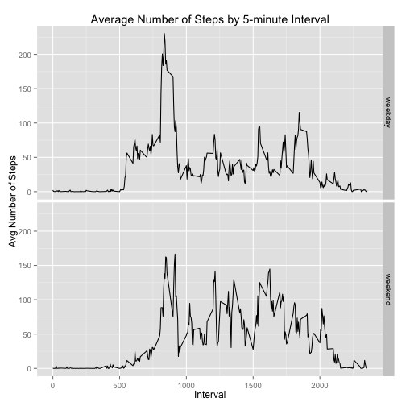

Reproducible Research: Peer Assessment 1
========================================

## Load required libraries

```r
library(lubridate)
library(dplyr)
library(ggplot2)
```

## Loading and preprocessing the data

We assume that the data file "activity.zip" is present in the working directory. Load the date into a data frame -- dat.

```r
if (!file.exists("./activity.csv")) unzip("./activity.zip", exdir = ".")
dat <- read.csv("activity.csv", header = TRUE, sep = ",")
dat$date <- ymd(dat$date) # convert to POSIXct
```

## What is mean total number of steps taken per day?


```r
# calculate total steps taken by day
grp_dat <- dat %>% group_by(date) %>% 
        summarize(total_steps = sum(steps))

g <- ggplot(data = grp_dat, aes(grp_dat$total_steps)) + geom_histogram()
    g <- g + labs(title = "Histogram of Total Steps taken by Day") # add title 
    g <- g + labs(x = "Total Steps", y = "Count")  # add x and y labels
    print(g)
```

```
## stat_bin: binwidth defaulted to range/30. Use 'binwidth = x' to adjust this.
```

 

What are the mean and median values of total steps taken by day?

```r
mean(grp_dat$total_steps, na.rm=TRUE)
```

```
## [1] 10766.19
```

```r
median(grp_dat$total_steps, na.rm=TRUE)
```

```
## [1] 10765
```

## What is the average daily activity pattern?

The following is a time series plot of the 5-minute interval (x-axis) and the average number of steps taken, averaged across all days (y-axis).

```r
grp_dat_intvl <- dat %>% group_by(interval) %>%
        summarize(avg_steps = mean(steps, na.rm=TRUE))
with(grp_dat_intvl, plot(interval, avg_steps, 
                             type = "l", 
                             ylab = "Average Steps", 
                             xlab = "Day/Time interval", 
                             col = "black"))
```

 

Which 5-minute interval, on average across all the days in the dataset, contains the maximum number of steps?

```r
grp_dat_intvl[grp_dat_intvl$avg_steps == max(grp_dat_intvl$avg_steps), ]
```

```
## Source: local data frame [1 x 2]
## 
##   interval avg_steps
## 1      835  206.1698
```

## Imputing missing values

Note that there are a number of days/intervals where there are missing values (coded as NA). The presence of missing days may introduce bias into some calculations or summaries of the data.

How many missing values does the dataset contain?

```r
nrow(dat[is.na(dat$steps),])
```

```
## [1] 2304
```

We impute missing values in the dataset. The strategy uses the mean for that 5-minute interval, averaged across all days. The result is stored in a new dataset--impdat.

```r
impdat <- merge(dat, grp_dat_intvl, by = "interval")
impdat <- impdat %>% 
        mutate(steps = ifelse(is.na(steps), avg_steps, steps)) %>%
        select(steps, date, interval) %>%
        arrange(date, interval)
```

Let's make another histogram of the total number of steps taken each day.

```r
# calculate total steps taken by day
grp_imp_dat <- impdat %>% group_by(date) %>% 
        summarize(total_steps = sum(steps))

g2 <- ggplot(data = grp_imp_dat, aes(grp_imp_dat$total_steps)) + geom_histogram()
    g2 <- g2 + labs(title = "Histogram of Total Steps taken by Day") # add title 
    g2 <- g2 + labs(x = "Total Steps", y = "Count")  # add x and y labels
    print(g2)
```

```
## stat_bin: binwidth defaulted to range/30. Use 'binwidth = x' to adjust this.
```

 

What are the mean and median values of total steps taken by day now?

```r
mean(grp_imp_dat$total_steps)
```

```
## [1] 10766.19
```

```r
median(grp_imp_dat$total_steps)
```

```
## [1] 10766.19
```

There is no significant difference in the values of mean and median values between the initial data set and the 'fixed' data set. The mean value is identical.  The median value has increased slightly by about one step. The impact of imputing missing data on the estimates is minimal.

## Are there differences in activity patterns between weekdays and weekends?

We shall create a new factor variable in the dataset with two levels--“weekday” and “weekend”-- indicating whether a given date is a weekday or weekend day.

```r
impdat <- impdat %>% mutate(weekend = factor(ifelse(grepl("Sat|Sun", wday(impdat$date, label = TRUE)), "weekend", "weekday")))
```

Here is a panel plot containing a time series plot of the 5-minute interval (x-axis) and the average number of steps taken, averaged across all weekday days or weekend days (y-axis).

First, group the 'fixed' data set by interval and weekday/weekend.

```r
grp_imp_dat_intvl <- impdat %>% group_by(interval, weekend) %>%
        summarize(avg_steps = mean(steps))

k <- ggplot(grp_imp_dat_intvl, aes(interval, avg_steps))
k <- k + facet_grid(weekend ~ .)
k <- k + geom_line()
k <- k + labs(title = "Average Number of Steps by 5-minute Interval")
k <- k + labs(x = "Interval", y = "Avg Number of Steps")
print(k)
```

 

This clearly shows a higher level of activity on weekday mornings (pre-9 am). Weekend activity does not show the spike pre-9am, but shows higher activity during the afternoon and early evening hours.
